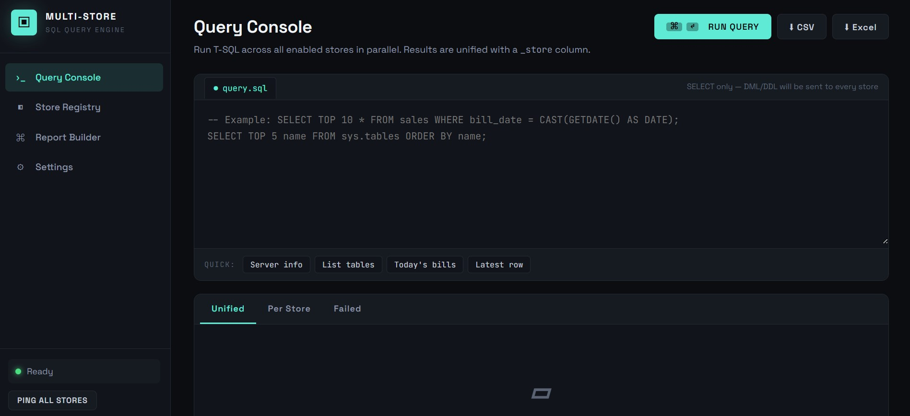
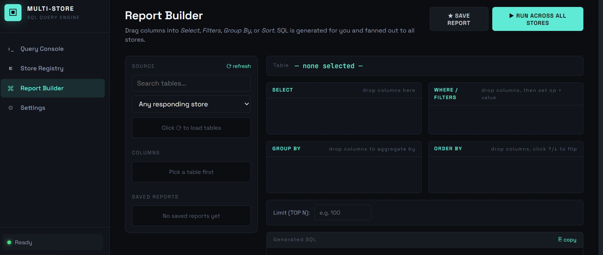
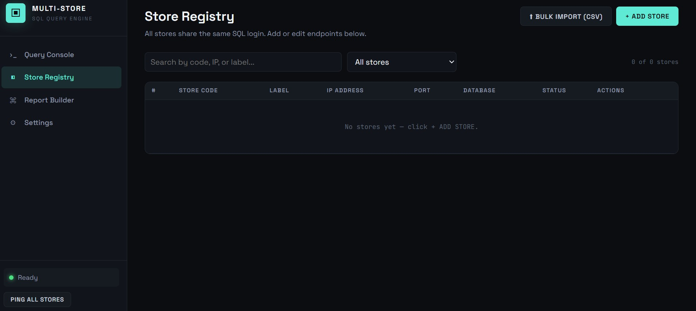
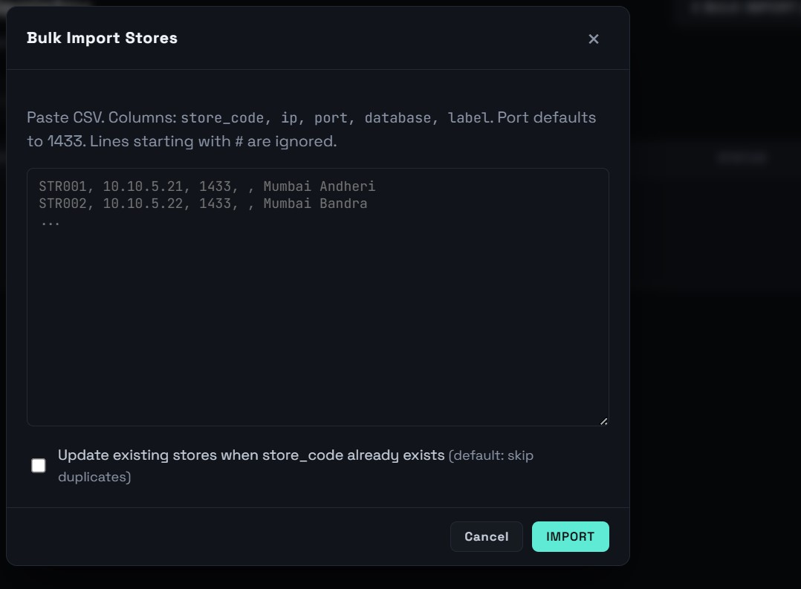
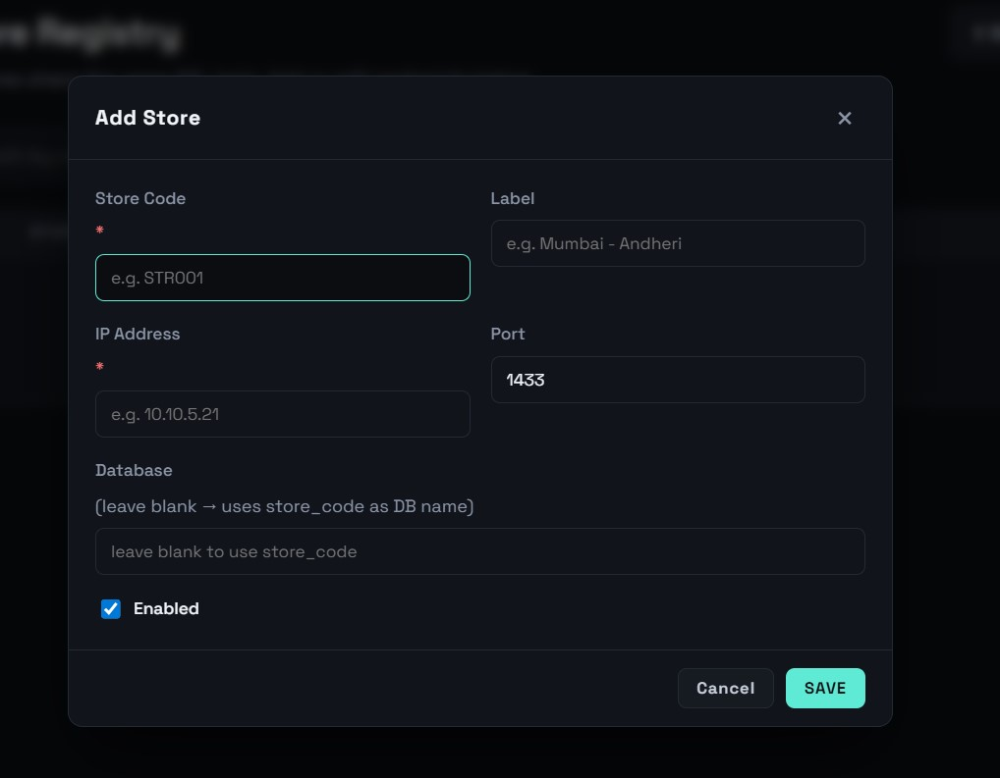

# 🏪 Multi-Store SQL Query Engine

> Execute SQL queries across **350+ store databases simultaneously** — get unified results in seconds instead of hours.

Built at **V2 Retail Ltd.** (350+ stores across India) to eliminate manual, store-by-store data retrieval for the HQ analytics team.

---

## 🚩 The Problem

V2 Retail has 350+ stores, each running its own **SQL Server database**. When HQ needed data — sales figures, stock levels, transaction records — analysts had to:

- Query each store database **one by one**, or
- Wait for a **nightly batch sync** that was always stale by morning

For a 350-store chain, this meant hours of manual effort for a single ad-hoc question.

---

## ✅ The Solution

A **FastAPI web application** that takes one SQL query and fires it to all 350+ store databases **in parallel** — simultaneously — then aggregates every result into a single unified table.

**What used to take hours now takes seconds.**

---

## ✨ Features

| Feature | Description |
|---|---|
| ⚡ **Parallel Execution** | Queries all stores simultaneously using asyncio + thread pool |
| 🔒 **Concurrency Control** | Semaphore limits to 60 concurrent connections — safe for the network |
| ⏱️ **Timeouts** | Per-store connect (5s) and query (30s) timeouts — offline stores don't block results |
| 🏗️ **Report Builder** | Drag-and-drop no-code report builder — no SQL knowledge required |
| 📊 **CSV / XLSX Export** | Download full unified results as CSV or Excel |
| 🏥 **Health Monitor** | Live connectivity check — see which stores are online/offline |
| 📝 **Query History** | Log of all executed queries with timing and success/fail counts |
| 🔧 **Store CRUD** | Add, edit, enable/disable stores via web UI — no code changes needed |
| 💾 **Schema Explorer** | Browse tables and columns from any store directly in the UI |
| 📦 **Bulk Import** | Import all 350+ store configs at once via JSON |

---

## 🛠️ Tech Stack

```
Backend     →  Python 3.11+  |  FastAPI  |  asyncio
Database    →  SQL Server (stores)  |  SQLite (store registry)
Connector   →  pyodbc  |  ODBC Driver 17 for SQL Server
Frontend    →  Jinja2 templates  |  HTML/CSS/JS
```

---

## ⚙️ How It Works

```
User submits SQL query
        │
        ▼
FastAPI loads all enabled stores from SQLite registry
        │
        ▼
asyncio Semaphore (max 60 concurrent)
        │
   ┌────┴────────────────────────────────────────────┐
   │    run_in_executor → thread pool                │
   │                                                  │
  Store_001   Store_002   Store_003  ...  Store_350  │
  SQL Server  SQL Server  SQL Server      SQL Server  │
   │                                                  │
   └────┬────────────────────────────────────────────┘
        │
        ▼
Results merged → unified table (+ failed stores list)
        │
        ▼
   Web UI / CSV / XLSX download
```

### Why `run_in_executor`?

`pyodbc` (the SQL Server connector) is **synchronous and blocking** — it has no async support. Calling it directly inside an `async` function would freeze the entire event loop.

`run_in_executor` runs each blocking DB call in a **thread pool**, keeping the async event loop free to manage all 350 concurrent tasks efficiently.

---

## 🚀 Setup & Installation

### Prerequisites

- Python 3.11+
- [ODBC Driver 17 for SQL Server](https://learn.microsoft.com/en-us/sql/connect/odbc/download-odbc-driver-for-sql-server) installed on the host machine
- Network access to store SQL Server instances

### Install

```bash
git clone https://github.com/MayankSingh1111/multistore-query-engine
cd multistore-query-engine
pip install -r requirements.txt
```

### Configure

Edit `app/main.py` and set your shared credentials:

```python
DEFAULT_USERNAME = "your_username"
DEFAULT_PASSWORD = "your_password"
DEFAULT_DATABASE = "your_db_name"
```

Or set via environment variables:

```bash
set STORE_USER=your_username
set STORE_PASS=your_password
set STORE_DB=your_db_name
```

### Run

```bash
cd app
uvicorn main:app --host 0.0.0.0 --port 8000 --reload
```

Open `http://localhost:8000` in your browser.

---

## 📂 Project Structure

```
multistore-query/
├── app/
│   ├── main.py              # FastAPI app — all routes, DB logic, parallel engine
│   ├── static/              # CSS, JS assets
│   ├── templates/           # Jinja2 HTML templates
│   │   ├── index.html       # Query console
│   │   ├── stores.html      # Store management
│   │   ├── builder.html     # Drag-and-drop report builder
│   │   └── settings.html    # Credentials and config
│   └── stores.db            # Auto-created SQLite store registry
├── requirements.txt
└── README.md
```

---

## 🖥️ Screenshots

## 🖥️ Screenshots

### Query Console


### Report Builder


### Store Results





| Write SQL, run on all stores | Add/edit/enable stores | Build reports without SQL |

---

## 📡 API Reference

| Method | Endpoint | Description |
|---|---|---|
| `POST` | `/api/query` | Run SQL on all/selected stores |
| `POST` | `/api/query/csv` | Run SQL + download CSV |
| `POST` | `/api/query/xlsx` | Run SQL + download Excel |
| `POST` | `/api/health` | Ping all stores for connectivity |
| `GET` | `/api/stores` | List all registered stores |
| `POST` | `/api/stores` | Add a new store |
| `POST` | `/api/stores/bulk` | Bulk import stores (JSON) |
| `PATCH` | `/api/stores/{code}` | Update store details |
| `DELETE` | `/api/stores/{code}` | Remove a store |
| `GET` | `/api/schema/tables` | List tables from a store |
| `GET` | `/api/schema/columns` | List columns for a table |
| `GET` | `/api/history` | Query execution history |

---

## 🔑 Key Technical Decisions

**Why SQLite for the store registry?**
Using SQL Server for the registry would create a circular dependency — you'd need a DB connection just to find out which DBs to connect to. SQLite is embedded, zero-config, and always available.

**Why cap preview rows at 10,000?**
The browser UI renders the first 10,000 rows for display. Full datasets (potentially millions of rows across 350 stores) are available via the CSV/XLSX export endpoints, which stream directly without loading everything into memory.

**Why not use a connection pool?**
With 350+ unique servers, a persistent connection pool would hold hundreds of open TCP connections. Instead, connections are opened, used, and closed per query — controlled by the semaphore to prevent network overload.

---

## 📈 Impact

- **Before**: Hours of manual store-by-store querying or waiting for nightly sync
- **After**: Any analyst runs a query across all 350+ stores in **under 60 seconds**
- Non-technical MIS staff use the report builder — no SQL knowledge needed
- Live health monitoring shows store connectivity at a glance

---

## 👤 Author

**Mayank Singh** — MIS Executive, V2 Retail Ltd.

[](https://linkedin.com/in/mayank-singh-0162a920a)
[](https://github.com/MayankSingh1111)
